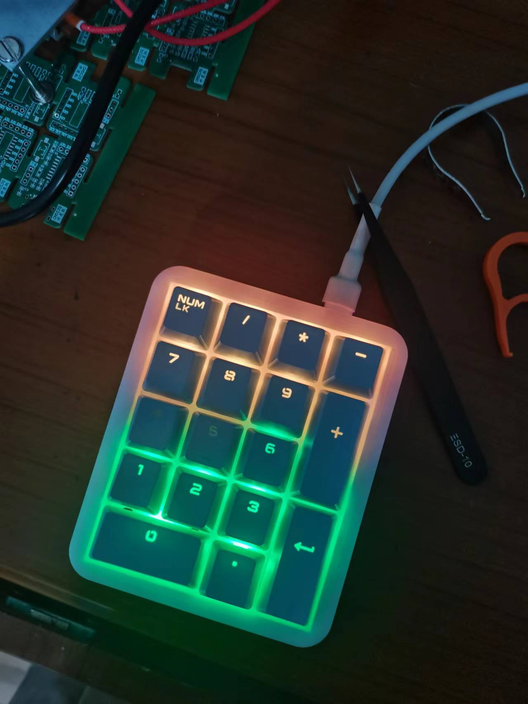
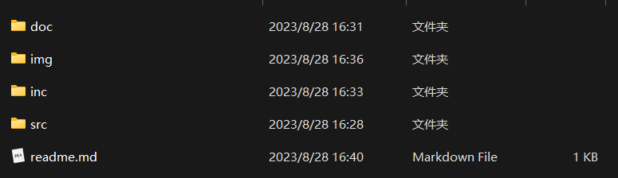

# 仓库说明

## 一、项目简介

该项目是基于 **CH552G** 的一款多功能小键盘，具有自定义按键功能，其拥有多彩RGB灯效，内置三种不同的灯光效果，可以通过手动切换。

其完整效果图如下所示：

## 二、仓库文件说明

通过下载文件后，可以看到仓库结构如下所示：

- 其项目结构如下：
  - `doc`：该文件放置主要的文档以及说明文件
  - `img`：该文件放置图片
  - `inc`：该文件放置部分例程以及硬件（PCB源文件）和3D建模文件
  - `src`：该文件放置工程代码

## 三、其他

- 如果在复刻过程中遇到问题，欢迎大家通过以下方式联系我
  - 个人CSDN账号：[刘梓谦_-CSDN博客](https://blog.csdn.net/liujiahao_)
  - Gitee：[刘佳豪 (liu-jiahaohappy) - Gitee.com](https://gitee.com/liu-jiahaohappy)
  - GitHub：[Jiahao-Liu29 (github.com)](https://github.com/Jiahao-Liu29)

